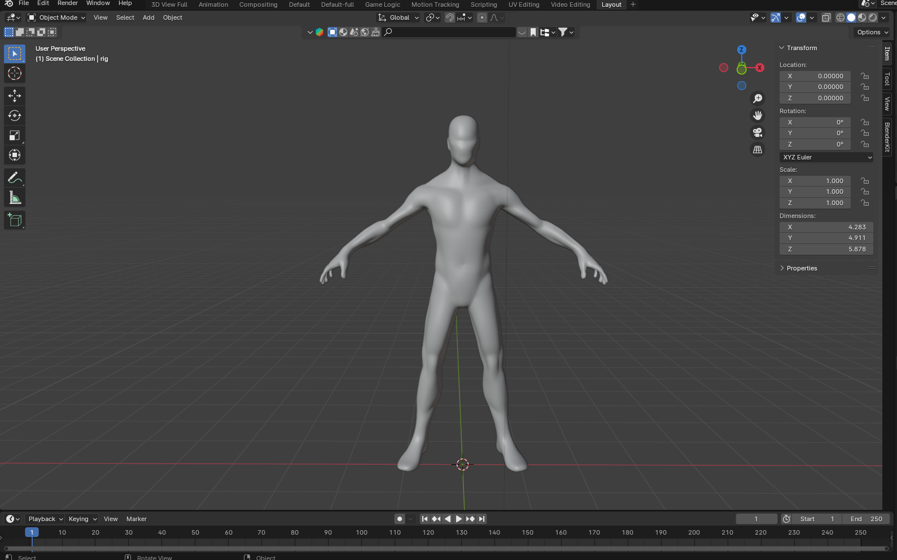

# Blender Skeletal Character Animation Project

Welcome to the Blender Skeletal Character Animation Project! This project aims to provide a comprehensive demonstration of character animation in Blender, encompassing both healthy and movement disorder conditions.

## Project Overview

The steps I took to complete this project are as follows:

1. **Creating and Animate a Skeletal Character:**
   - I actually  used an existing character mesh.
   - 
   - I rigged the model using the Rigify Add-on in blender.
   - 
   - Sculpting face  details, adding hair, and clothing were added manually.
   -    

2. **Add Textures and Clothing:**
   - Enhance the visual appeal by incorporating suitable textures and clothing onto the animated character.
   - 

3. **Animate Healthy Conditions:**
   - Demonstrated four common human motion patterns (e.g., walking, running, jumping, sitting) under healthy conditions.

4. **Animate Movement Disorder Conditions:**
   - Mimicked clinically known movement disorders as closely as possible (Hemiplegic Gait, Myopathic Gait).
   - Myopathic Gait Reference: https://www.youtube.com/watch?v=b5rIEx9SsCo 
   - Hemiplegic Gait Reference: https://www.youtube.com/watch?v=y160w4sAQNw

## Getting Started

Follow these steps to set up the project on your local machine:

### Prerequisites

- Install Blender: [Blender Official Website](https://www.blender.org/download/)

### Installation

1. Clone the repository:

2. Open the Blender project file (`Character_animation.blend`) in Blender.

## Features

- Fully customizable skeletal character.
- Diverse motion patterns for healthy conditions.
- simulation of movement disorders.

## Dependencies

- Blender.

Happy animating!